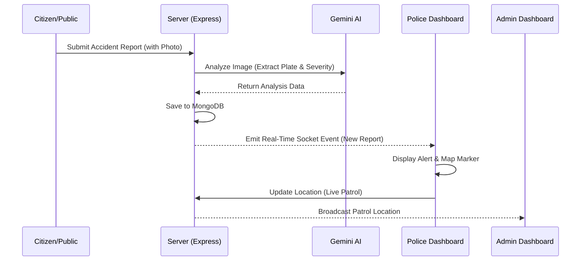

# Road Accident Witness Hub 🚨

A full-stack MERN (MongoDB, Express, React, Node.js) application for reporting and managing road accident data, featuring real-time updates and role-based dashboards for Citizens, Administrators, and Police Officers.

## 🌟 Features
-   **Public Portal**: Report accidents without login (optional) or via Citizen Dashboard.
-   **Role-Based Access**:
    -   **Citizen (Green Theme)**: Submit reports, track personal history.
    -   **Admin (Red Theme)**: Global overview, manage users, system health.
    -   **Police (Blue Theme)**: Real-time report alerts, patrol tracking, vehicle lookup.
-   **Gemini AI Integration**: Automated license plate extraction and severity analysis from photos.
-   **Real-Time Tracking**: Socket.io powered live notifications and police patrol tracking.
-   **Secure Authentication**: JWT-based security with role-specific redirection.

---

## 🛠️ Prerequisites

Ensure you have the following installed:
-   **Node.js** (LTS version)
-   **MongoDB** (Local or Atlas)
-   **Git**

---

## 🚀 Installation & Setup

### 1. Clone the Repository
```bash
git clone https://github.com/unnikrishnan-sics/Road-Accident-Witness-Hub.git
cd "Road Accident Witness Hub"
```

### 2. Backend Setup
```bash
cd server
npm install
```
**Configuration**: Create a `.env` file in the `server` directory:
```env
PORT=5000
MONGO_URI=mongodb://localhost:27017/road_accident_hub
JWT_SECRET=your_jwt_secret_key
GEMINI_API_KEY=your_google_gemini_api_key
```

### 3. Frontend Setup
```bash
cd ../client
npm install
```

---

## 🔄 Updating the Project
If the project has already been cloned and you need to get the latest updates:
```bash
# Pull latest changes
git pull origin main

# Update dependencies (if package.json changed)
cd server && npm install
cd ../client && npm install
```

---

## 🏁 Running the Application

### Start Backend
```bash
cd server
npm run dev
```

### Start Frontend
```bash
cd client
npm run dev
```
Open **http://localhost:5173** in your browser.

---

## 🧩 User Modules & Functions

### 1. Authentication Module (`authController.js`)
-   `registerUser`: Creates new Citizen accounts.
-   `loginAdmin`: Unified login for all roles (Admin, Police, Citizen).
-   `getMe`: Retrieves current logged-in user profile.
-   `updatePatrolStatus`: Allows Police to toggle active patrol mode for live tracking.

### 2. Accident Reporting Module (`reportController.js`)
-   `createReport`: Handles report submission with optional photo uploads.
-   `analyzeImage`: Uses **Gemini AI** to extract vehicle numbers and analyze damage severity from images.
-   `getMyReports`: Fetches history for the logged-in Citizen.
-   `getAllReports`: Admin/Police view of all reports with vehicle number filtering.
-   `updateReportStatus`: Enables Police/Admin to mark reports as 'Investigated' or 'Resolved'.

---

## 🌊 Project Flow



1.  **Reporting**: A witness (Citizen) submits an accident report with details and photos.
2.  **AI Analysis**: The system automatically uses Gemini AI to identify the vehicle's license plate and estimate the severity of the accident.
3.  **Real-Time Alert**: Seconds after submission, all active Police Dashboards receive a real-time notification via Socket.io.
4.  **Response & Patrol**: Police officers can see the report on a map, start a "Patrol" to share their live location, and update the status of the investigation.
5.  **Monitoring**: Admins monitor the entire system, manage users, and view global statistics.

---

## 🔐 Default Credentials
The system auto-seeds these accounts on first run:
-   **Admin**: `admin@gmail.com` / `admin@123`
-   **Police**: `police@gmail.com` / `police@123`

---

## 📂 Project Structure
```
Road Accident Witness Hub/
├── client/                 # Vite + React Frontend
│   ├── src/
│   │   ├── pages/         # Dashboard (Admin, Police, Reporter) & Pages
│   │   ├── components/    # Reusable UI (Maps, Navbar, Layouts)
│   │   └── App.jsx        # Routing & Theme Configuration
├── server/                 # Node.js + Express Backend
│   ├── controllers/       # Core Business Logic
│   ├── models/            # Database Schemas (User, Report)
│   ├── routes/            # API Endpoints
│   ├── uploads/           # Stored Accident Photos
│   └── index.js           # Entry Point & Socket.IO Setup
└── README.md
```
